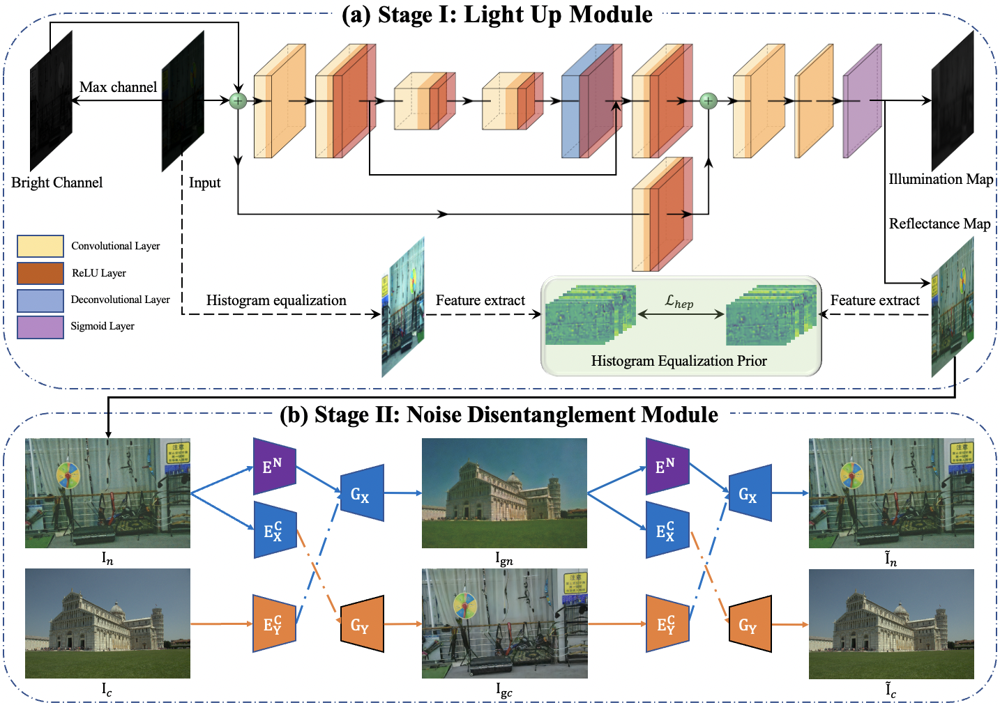

## Implementation
* Python3
* PyTorch>=1.0
* NVIDIA GPU+CUDA

## Training process

The original LOL dataset can be downloaded from [here](https://daooshee.github.io/BMVC2018website/).
The EnlightenGAN dataset can be downloaded from [here](https://drive.google.com/drive/folders/1fwqz8-RnTfxgIIkebFG2Ej3jQFsYECh0)
Before starting training process, you should modify the data_root in `./config`, and then run the following command

```shell
python LUM_train.py
python NDM_train.py
```

### Testing process

Please put test images into 'test_images' folder and download the pre-trained checkpoints from [google drive](https://drive.google.com/drive/folders/1LaeLhaFkrB7a7u5t-mVPuK81C4K1gtil?usp=sharing)(put it into `./checkpoints`), then just run

```shell
python NDM_test.py
```

You can also just evaluate the stage one (LUM), just run

```shell
python LUM_test.py
```

## Paper Summary
HEP consists of two stages, Light Up Module (LUM) and Noise Disentanglement Module (LUM)


## Representative Visual Results


